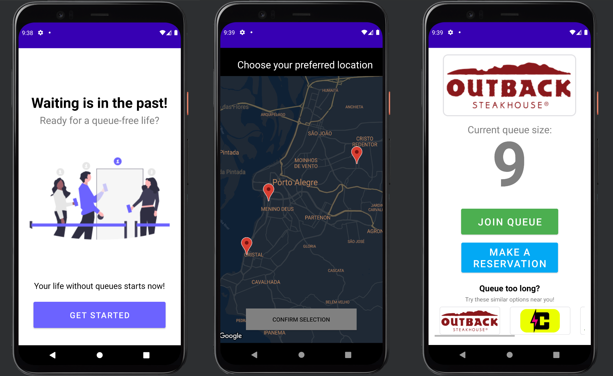

# QueueManager

An Android app created for people to join queues to attend events.  
The user selects one of the registered establishments, selects an instance in the map and joins the queue.  

The app it's just a prototype so far.  
This project implements the front-end in Android Studio, and creates it's own database without data persistance.   
